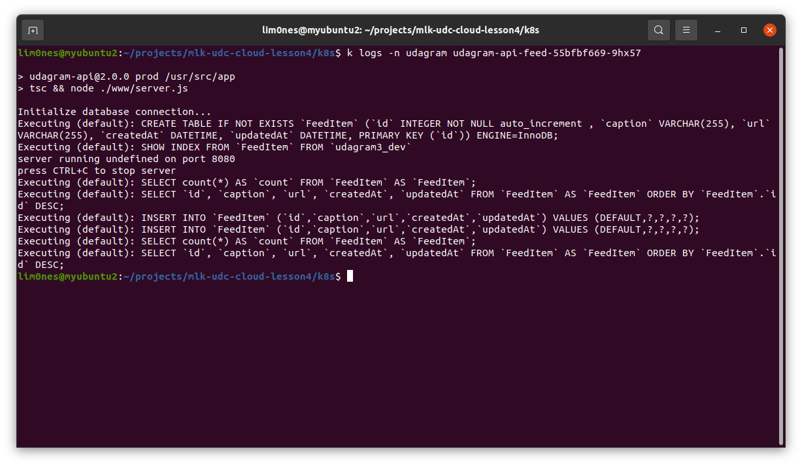

# Refactor Monolith Microservices

Hi! Thanks for checking my code! 😋
Here you will find the solution for the exercises.

# Structure

```
...
├── k8s/						# Constains all k8s yaml files
├── udagram-api-feed/ 			# API feed service code files
├── udagram-api-user/ 			# API user service code files
├── udagram-frontend/			# FrontEnd application code files
├── reverseproxy/ 		        # NGinx project used as reverse proxy to connect with the services/
├── ... 
├── .travis.yml 				# Yaml file to configure travis pipelines
├── docker-compose-build.yaml 	# Docker helper file, used for building purposes
├── docker-compose.yaml 		# Docker helper file, used to run the solution locally
├── udacity-c2-restapi.json 	# Contains all endpoints and tests configured
├── ...
└── ...
```
## Dependencies

 - Kubernetes environment
 - AWS credentials configured
 - Docker hub credentials configured and set
 - EKS client API

To develop the application you will need a couple more things like NodeJS, but the focus here is how to deploy the solution.

## Container image publish

We have a Continuous Integration system running under TravisCI, and this is responsible for building and publishing the image on the docker hub.
As soon as you merge your code into main, this process will be triggered.

## To build the application locally

Run the command below:
```
docker-compose -f docker-compose-build.yaml
```
## To run the application locally
You will need some environment variables created on your machine, the names describe the intuition of each of them (at least I think so 😁).
Be sure you are on the root of the solution.

    export DB_USERNAME=*****
    export DB_PASS=*****
    export DB_NAME=*****
    export DB_HOST=*****
    export DB_DIALECT=*****
    export AWS_REGION=*****
    export AWS_PROFILE=*****
    export AWS_BUCKET=*****
    export JWT_SECRET=*****
    
    docker-compose .

## To deploy the application

### AWS Commands to create Cluster

Below the commands used to configure the environment. All the values mentioned here can be easily changed.

    # Check the profile used to connect to AWS, pay attention to the profile used here. You will need it during the creation of secrets
    aws sts get-caller-identity
    
    # In case you need to change the profile just set the env variable above, with the desired aws profile, in my case dev
    export AWS_PROFILE=dev
    
    # To create command
    eksctl create cluster \
     --name udagram3 \
     --with-oidc \
     --without-nodegroup
    
    # To create nodegroup
    eksctl create nodegroup \
      --cluster udagram3 \
      --region us-west-2 \
      --name udagram3-node-group \
      --node-type m5.large \
      --nodes 2 \
      --nodes-min 2 \
      --nodes-max 3 \
    
    # Used to configure the kubeconfig
    aws eks --region us-west-2 update-kubeconfig --name udagram3
    
    # Now you should be able to connect eks using kubectl commands, try the command below
    kubectl get pods

In case your `kubectl get` commands failed to connect to the AWS environment, this may be related to the profile used, try to use the same profile used to create the environment

### Accessing the frontend application

Run the command `k get svc -n udagram publicfrontend` to find the EXTERNAL-IP for the frontend service. In this case with the address `a1c7204e420714afca79a6b3d168a16f-1091142114.us-west-2.elb.amazonaws.com` on the clipboard just paste it into Chrome, you should now be able to access the application.

       #:~/projects/mlk-udc-cloud-lesson4$ k get svc -n udagram publicfrontend
        NAME                 TYPE           CLUSTER-IP       EXTERNAL-IP                                                               PORT(S)          AGE
        publicfrontend       LoadBalancer   10.100.149.154   a1c7204e420714afca79a6b3d168a16f-1091142114.us-west-2.elb.amazonaws.com   80:31260/TCP     26h
        

Run the command `k get svc -n udagram publicreverseproxy` to find the EXTERNAL-IP for the reverseproxy service. In this case with the address `ae585a066ba084ad8a37e2c9b9a28b19-739838379.us-west-2.elb.amazonaws.com`(add `:8080/api/v0/feed` to the end of the url), on the clipboard just paste it into Chrome, you should now be able to view the list of feeds registered.

       #:~/projects/mlk-udc-cloud-lesson4$ k get svc -n udagram publicreverseproxy
        NAME                 TYPE           CLUSTER-IP       EXTERNAL-IP                                                              PORT(S)          AGE
        publicreverseproxy   LoadBalancer   10.100.224.161   ae585a066ba084ad8a37e2c9b9a28b19-739838379.us-west-2.elb.amazonaws.com   8080:30666/TCP   26h


The `udacity-c2-restapi.postman_collection.json` file can be imported into Postman and used with this last EXTERNAL-IP found to access the api application.

## Evidences

### Containers and Microservices


### Independent Releases and Deployments


### Service Orchestration with Kubernetes

#### Deploy microservices using a Kubernetes cluster on AWS


#### Configure scaling and self-healing for each service


### Debugging, Monitoring, and Logging

#### Use logs to capture metrics for debugging a microservices deployment


